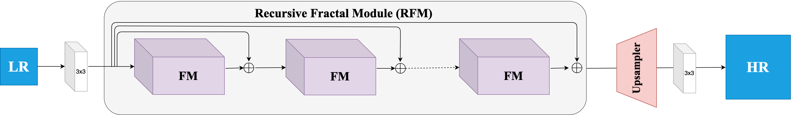
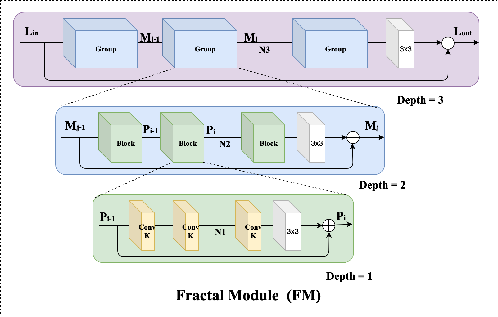
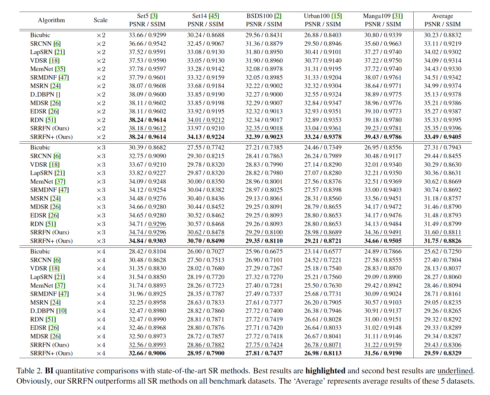
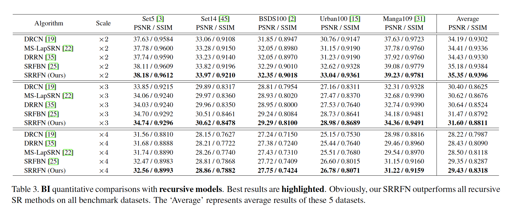
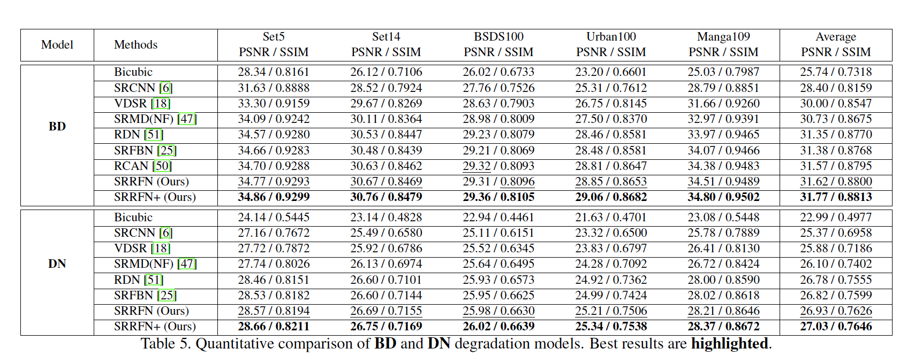
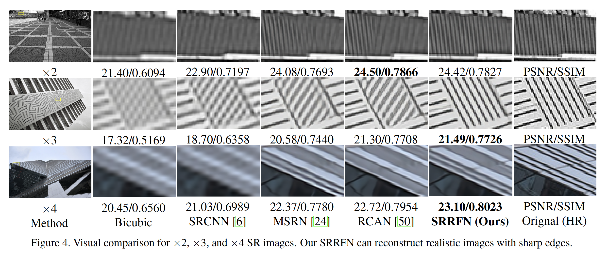
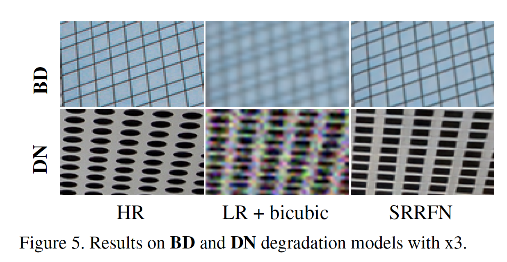

# SRRFN-PyTorch
This repository is a PyTorch version of the paper "Lightweight and Accurate Recursive Fractal Network for Image Super-Resolution" (ICCVW 2019, Oral).

## The old paper download link was wrong~ sorry. We have corrected the link! 

### Paper can be download from <a href="https://junchenglee.com/paper/ICCVW_LCI_2019.pdf">SRRFN</a> 

### All reconstructed images can be downloaded from  <a href="https://www.jianguoyun.com/p/DYQ40G8Q19ySBxjyzNUB">ICCVW2019_SRRFN_SR_image</a> （Including SRRFN and SRRFN+）.

All original test datasets (HR images) can be downloaded from <a href="https://www.jianguoyun.com/p/DaSU0L4Q19ySBxi_qJAB">here</a>

All test datasets (BI, Preprocessed LR images) can be downloaded from <a href="https://www.jianguoyun.com/p/DcrVSz0Q19ySBxiTs4oB">here</a>.

All test datasets (BD, DN, Preprocessed LR images) can be downloaded from <a href="https://www.jianguoyun.com/p/DTNrOowQ19ySBxicie4B">here</a>.

All model weight can be found in:  Test/model


## Abstract
Convolutional neural networks have recently achieved great success in image super-resolution (SR). However, we notice an interesting phenomenon that these SR models are getting bigger, deeper, and more complex. Extensive models promote the development of SR, but the effectiveness, reproducibility and practical application prospects of these new models need further verification. In this paper, we propose a lightweight and accurate SR framework, named Super-Resolution Recursive Fractal Network (SRRFN). SRRFN introduces a flexible and diverse fractal module, which enables it to construct infinitely possible topological substructure through a simple component. We also introduce the recursive learning mechanism to maximize the use of model parameters. Extensive experiments show that our SRRFN achieves favorable performance against state-ofthe- art methods with fewer parameters and less execution time.

<p align="center">

</p>

Fractal Structure: (a). self-similarity (b). infinitely fine structure (c). can be defined by a simple method and generated by recursion and iteration.


## Architecture

<p align="center">

</p>

The architecture of our proposed Super-Resolution Recursive Fractal Network (SRRFN). All FMs are weight sharing.

The FM has no fixed structure. It consists of a basic component and a parameter (fractal depth, D). Different network structures can be generated by changing the component and depth.

## An example of FM

<p align="center">

</p>

We set D = 3, K = 3, N1 = 1, N2 = 10, N3 = 5, and S = 4 in the final SRRFN. This case is like a lightweight recursive RCAN.

It is worth noting that the purpose of this paper is to propose the idea of fractal framework. The basic components of FM can be easily replaced by existing network modules (e.g., dense block, memory block, and res2net blok).


## Experiments

### Prerequisites:
1. Python 3.6
2. PyTorch >= 0.4.0
3. numpy
4. skimage
5. imageio
6. matplotlib
7. tqdm

This project is based on EDSR. Therefore, you can found more information in <a href="https://github.com/thstkdgus35/EDSR-PyTorch">EDSR</a> .


#### We only provide the code for the case in the paper.
#### In this case, we use the residual block as the component of FM.
#### Therefore, this case can be see as a lightweight recursive RCAN.
#### More robust and versatile code of Fractal Module (FM) will be released after our new research work is over.


## Document
Train/             : all train files

Test/              : all test files

demo.sh        : all running instructions


### Training Dataset
We used DIV2K (1-800) dataset as our training dataset. Please download it from <a href="https://data.vision.ee.ethz.ch/cvl/DIV2K/">here</a>  or  <a href="https://cv.snu.ac.kr/research/EDSR/DIV2K.tar">SNU_CVLab</a>.

Extract the download file and put it into the Train/dataset.


### Training

```
# SRRFN x2  LR: 48 * 48  HR: 96 * 96
python main.py --template SRRFN --save SRRFN_X2 --scale 2 --reset --save_results --patch_size 96 --ext sep_reset

# SRRFN x3  LR: 48 * 48  HR: 144 * 144
python main.py --template SRRFN --save SRRFN_X3 --scale 3 --reset --save_results --patch_size 144 --ext sep_reset

# SRRFN x4  LR: 48 * 48  HR: 192 * 192
python main.py --template SRRFN --save SRRFN_X4 --scale 4 --reset --save_results --patch_size 192 --ext sep_reset
```
More running instructions can be found in demo.sh.


## Testing
Using pre-trained model for training, all test datasets must be pretreatment by  ''Test/Prepare_TestData_HR_LR.m" and all pre-trained model can be found in "Test/model/".

```
# BI model
#SRRFN x2
python main.py --data_test MyImage --scale 2 --model SRRFN --degradation BI --pre_train ../model/SRRFN_x2_BI.pt --test_only --save_results --chop --save "SRRFN" --testpath ../LR/LRBI --testset Set5

#SRRFN+ x2
python main.py --data_test MyImage --scale 2 --model SRRFN --degradation BI --pre_train ../model/SRRFN_x2_BI.pt --test_only --save_results --chop --self_ensemble --save "SRRFN_plus" --testpath ../LR/LRBI --testset Set5


# BD model
#SRRFN_BD x3
python main.py --data_test MyImage --scale 3 --model SRRFN --degradation BD --pre_train ../model/SRRFN_x3_BD.pt --test_only --save_results --chop --save "SRRF" --testpath ../LR/LRBD --testset Set5

#SRRFN+_BD x3
python main.py --data_test MyImage --scale 3 --model SRRFN --degradation BD --pre_train ../model/SRRFN_x3_BD.pt --test_only --save_results --chop --self_ensemble --save "SRRFN_plus" --testpath ../LR/LRBD --testset Set5


# DN model
#SRRFN_DN x3
python main.py --data_test MyImage --scale 3 --model SRRFN --degradation DN --pre_train ../model/SRRFN_x3D_DN.pt --test_only --save_results --chop --save "SRRF" --testpath ../LR/LRDN --testset Set5

#SRRFN+_DN x3
python main.py --data_test MyImage --scale 3 --model SRRFN --degradation DN --pre_train ../model/SRRFN_x3D_DN.pt --test_only --save_results --chop --self_ensemble --save "SRRFN_plus" --testpath ../LR/LRDN --testset Set5
```

We also introduce self-ensemble strategy to improve our SRRFN and denote the self-ensembled version as SRRFN+.
More running instructions can be found in demo.sh.


## Performance

Following previous works, our SRRFN is trained on RGB images, but the reported PSNR/SSIM results are evaluated on the Y channel of the transformed YCbCr space.


### PSNR/SSIM on BI model

<p align="center">

</p>

<p align="center">

</p>


### PSNR/SSIM on BD / DN model

<p align="center">

</p>

### Visual comparison on BI model

<p align="center">

</p>

### Visual comparison on BD / DN model

<p align="center">

</p>


```
@InProceedings{Li_2019_ICCV_Workshops,
author = {Li, Juncheng and Yuan, Yiting and Mei, Kangfu and Fang, Faming},
title = {Lightweight and Accurate Recursive Fractal Network for Image Super-Resolution},
booktitle = {The IEEE International Conference on Computer Vision (ICCV) Workshops},
year = {2019},
pages={3814-3823}
}
```

Welcome to cite and compare our SRRFN, please contact me if you have any questions about the code.
E-mail: cvjunchengli@gmail.com
